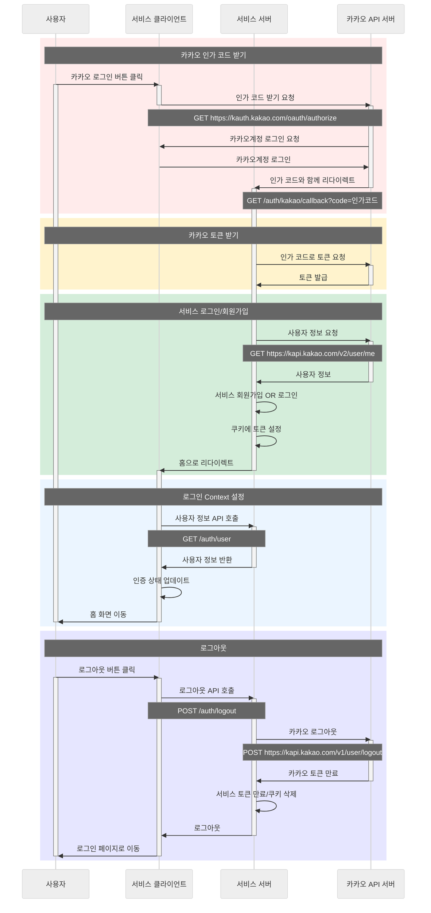

# 카카오 로그인

카카오 로그인 기능 확인을 위한 연습용 프로젝트입니다.

## 프로젝트 구성

```
kakao-login/
├── client/          # React 클라이언트 (포트: 5173)
├── server/          # NestJS 서버 (포트: 3001)
└── README.md        # 프로젝트 개요
```

## 시작하기

### 1. 의존성 설치

```bash
yarn install:all
```

### 2. 환경변수 설정

- [클라이언트 환경변수 설정](./client/README.md#2-환경변수-설정)
- [서버 환경변수 설정](./server/README.md#2-환경변수-설정)

### 3. 개발 서버 실행

```bash
yarn dev
```

## 상세 문서

- [클라이언트 README](./client/README.md)
- [서버 README](./server/README.md)

## 로그인/로그아웃 플로우


