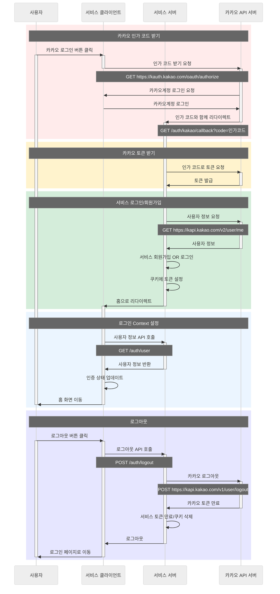

# React + TypeScript + Vite

[카카오 로그인 프로세스](https://developers.kakao.com/docs/latest/ko/kakaologin/rest-api#kakaologin)를 테스트하기 위한 클라이언트입니다.

## 실행시키기

### 1. 의존성 설치

```bash
yarn install
```

### 2. 환경변수 설정

프로젝트 root에 `.env.development` 파일을 생성하고 아래 내용을 추가해주세요.

```env
VITE_KAKAO_CLIENT_ID=your_kakao_client_id
VITE_KAKAO_REDIRECT_URI=http://localhost:3001/auth/kakao/callback
VITE_API_BASE_URL=http://localhost:3001
```

### 3. 개발 서버 실행

```bash
yarn dev
```

## 테스트한 내용

- **카카오 로그인/로그아웃 플로우**
- **쿠키를 활용한 토큰 관리**
- **Context를 활용한 전역 인증 상태 관리**
- **인증된 사용자만 접근 가능한 Protected Route**

## 프로젝트 구조

```
src/
├── api/               # API 클라이언트 및 사용자 API
├── assets/            # 에셋(이미지 등)
├── context/           # 인증 상태 관리(Context API)
├── layout/            # 공통 레이아웃 컴포넌트
├── pages/
│   ├── home/          # 홈(로그인 후) 페이지
│   └── login/         # 로그인 페이지
├── router/            # 라우터 및 인증 가드
├── App.tsx            # 앱 엔트리포인트
└── main.tsx           # React DOM 렌더링
```

## 로그인 플로우


