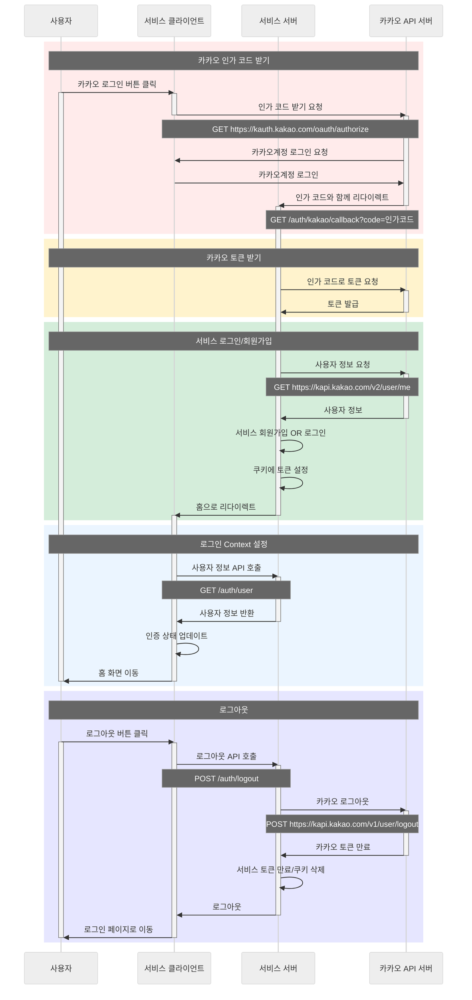

# 카카오 로그인 서버

> [!WARNING]  
> [Claude](https://claude.ai/)로 작성된 카카오 로그인 테스트용 서버입니다. 보안상 문제가 있을 수 있습니다.

## 실행시키기

### 1. 의존성 설치

```bash
yarn install
```

### 2. 환경변수 설정

프로젝트 root에 `.env` 파일을 생성하고 아래 내용을 추가해주세요.

```env
# 1. 환경 설정
NODE_ENV=development

# 2. 카카오 API 설정 (모두 필수)
KAKAO_CLIENT_ID=your_kakao_client_id
KAKAO_CLIENT_SECRET=your_kakao_client_secret
KAKAO_REDIRECT_URI=http://localhost:3001/auth/kakao/callback
KAKAO_ADMIN_KEY=your_kakao_admin_key

# 3. JWT 보안 설정 (필수)
JWT_SECRET=your_very_secure_jwt_secret_key

# 4. 서버 설정
PORT=3001
FRONTEND_URL=http://localhost:5173
```

### 3. 개발 서버 실행

```bash
yarn start:dev
```

## 테스트한 내용

- **카카오 로그인/로그아웃 플로우**
- **액세스 토큰과 리프레시 토큰 생성과 검증**
- **쿠키를 활용한 토큰 관리**: HttpOnly, Secure 쿠키
- **CORS 설정**
- **간단한 인메모리 사용자 데이터 관리**

## 프로젝트 구조

```
src/
├── app.controller.ts         # 기본 컨트롤러
├── app.module.ts             # 메인 애플리케이션 모듈
├── app.service.ts            # 기본 서비스
├── auth.controller.ts        # 인증 관련 엔드포인트
├── auth.service.ts           # 인증 비즈니스 로직
└── main.ts                   # 애플리케이션 진입점
```

## 로그인 플로우


